# **BurpSuite** Community Edition

## ¿Qué es BurpSuite Community Edition?

Es la versión gratuita de esta plataforma, que viene incluida por defecto en sistemas operativos como Parrot Security y Kali Linux. Su función principal es desempeñar el papel de proxy HTTP para la aplicación, facilitando la realización de pruebas de penetración.

[#] Puedes descargar BurpSuite Community Edition desde su web oficial: https://portswigger.net/burp/communitydownload

[#] Además, si te registras en https://portswigger.net podrás acceder a formación gratuita de calidad. Muy recomendable.

## ¿Qué es un proxy HTTP?

Un proxy HTTP es un filtro de contenido de alto rendimiento, ampliamente usado en el hacking con el fin de interceptar el tráfico de red. Esto permite analizar, modificar, aceptar o rechazar todas las solicitudes y respuestas de la aplicación que se esté auditando.

Un proxy HTTP actúa como intermediario entre el navegador y el servidor web, lo que permite interceptar y analizar todo el tráfico que fluye entre ellos. En pruebas de penetración, esta función es clave para detectar vulnerabilidades como inyecciones, autenticaciones incorrectas, y más.

## ¿Qué incluye la versión Community Edition?

**Herramientas básicas:** Incluye las herramientas esenciales para realizar pruebas de penetración en aplicaciones web, como el Proxy, el Repeater y el Sequencer.

**Intercepción y modificación de tráfico:** Permite interceptar y modificar las solicitudes y respuestas HTTP/HTTPS, facilitando la identificación de vulnerabilidades y la exploración de posibles ataques.

## Recursos adicionales

**Extensión Firefox**

Existe una extensión para navegadores basados en Firefox (también existe una versión para Chrome, buscar en Google 'foxyproxy chrome addon'). Esta extensión facilitará, como veremos, el uso de BurpSuite.

FoxyProxy addon: https://addons.mozilla.org/en-US/firefox/addon/foxyproxy-standard/

**Nota:** **FoxyProxy** es una extensión de navegador utilizada principalmente para gestionar y configurar proxies de manera eficiente. Compatible con los navegadores más populares como **Firefox** y **Google Chrome**, FoxyProxy permite cambiar entre proxies fácilmente, proporcionando una forma sencilla de administrar y automatizar la configuración de conexiones proxy.

**Certificado de BurpSuite para HTTPS** 

Por defecto, si usamos un navegador externo (como Firefox o Chrome) y no el 'Open Browser' (que es un navegador interno de BurpSuite basado en Chromium y que ya viene con todo instalado), necesitaremos instalar un certificado HTTPS para poder interceptar el tráfico que fluya por el protocolo HTTPS.

## ¿Cómo descargar el certificado HTTPS?

Sigue los siguientes pasos:

1. Para agregar el certificado es imprescindible abrir primero BurpSuite. Ejecuta BurpSuite, selecciona una sesión temporal y continúa.

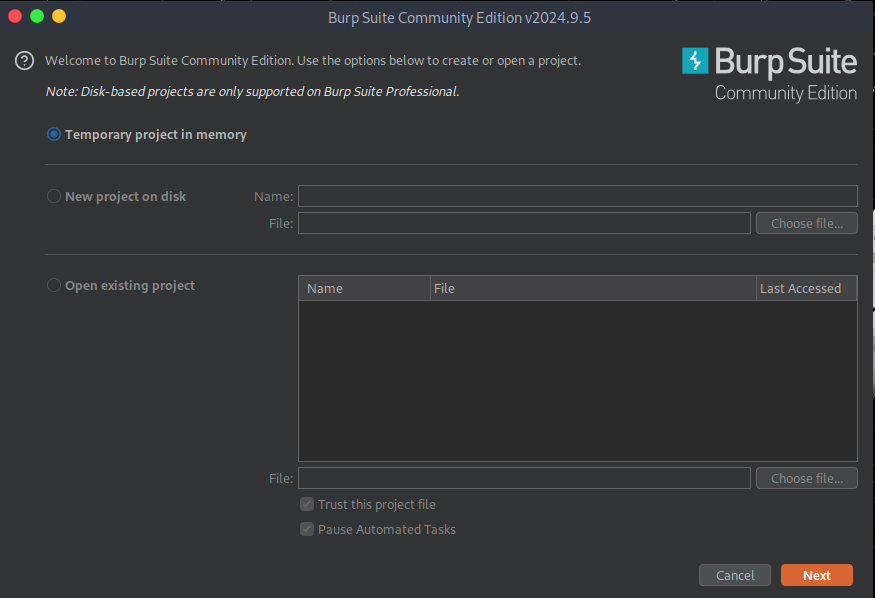

2. Configura, desde la pestaña de 'Proxy', los ajustes tal y como se ve en la imagen. Por defecto, debería venir configurado con su IP local y el puerto estándar de BurpSuite (8080). Esta misma configuración (IP:Puerto) deberá replicarla en 'FoxyProxy'.

3. Confirmada la configuración 'Proxy' de BurpSuite, procedemos a configurar las 'opciones/settings' de FoxyProxy. Para ello, acceda a su extensión y acceda a opciones como se muestra en la imagen:

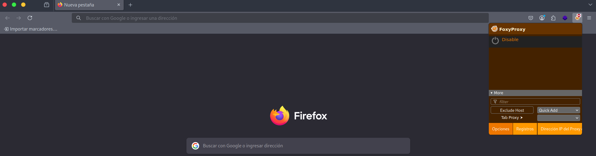

4. Configurar FoxyProxy de la siguiente manera:

   4.1. Campos necesarios: host (introducimos IP local, la misma que en BurpSuite), puerto (8080), tipo (HTTP), opcionalmente es recomendado poner un nombre (BurpSuite). Del mismo modo, es opcional indicar un color para la etiqueta 'BurpSuite' (naranja, en semejanza con BurpSuite).

   4.2. Salvamos/guardamos los cambios y ya deberíamos ver la etiqueta 'BurpSuite' al desplegar nuestra extensión FoxyProxy.

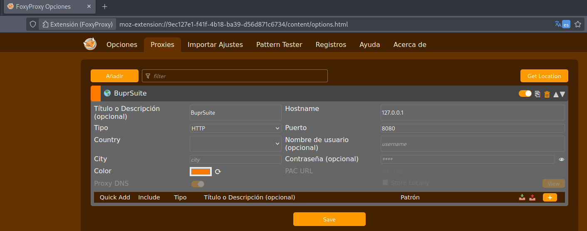

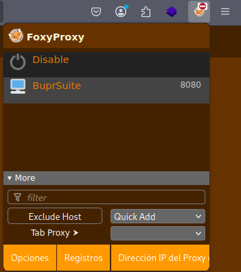

5. Acude a la siguiente dirección web: https://www.burp

   5.1. Necesitarás aceptar el acceso a la página como se muestra en la imagen:

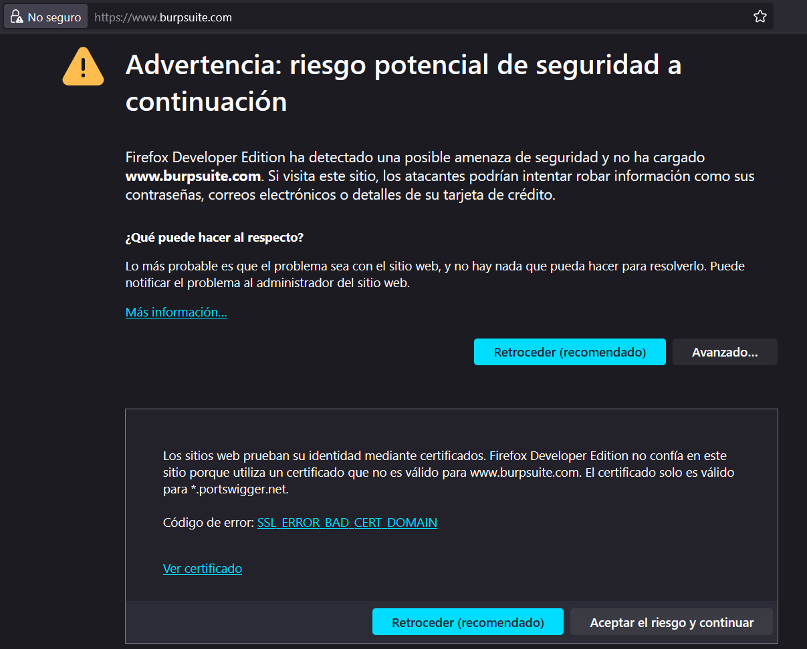

   5.2. Aceptamos el certificado y procederá a descargarse un archivo .der

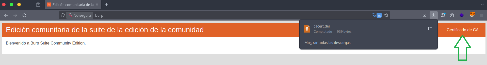

6. Una vez descargado, tenemos que acceder al apartado de ajustes/settings de nuestro navegador.

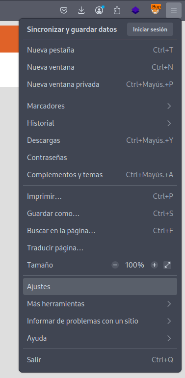

7. En el menú que nos aparece, en el buscador escribimos 'cert' y debería salirnos el apartado de 'Certificados', como se muestra en la imagen. Accedemos a 'Ver certificados' e importamos el archivo .der que acabamos de descargar.

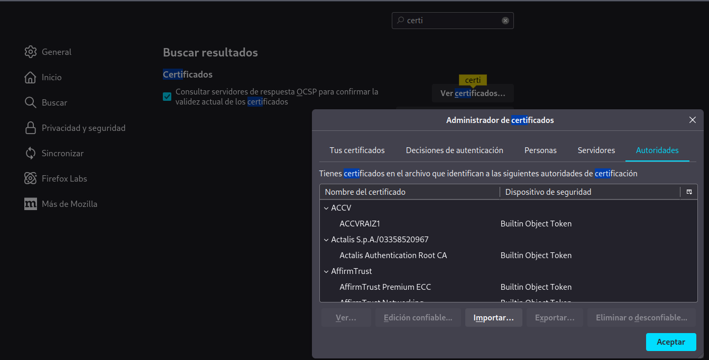

**Nota:** En Chrome se busca desde "Administrar certificados".

8. Tenemos que señalar 'Confiar en esta CA para identificar sitios web' y darle a aceptar.

9. Con estos pasos, deberíamos tener instalado el certificado HTTPS de BurpSuite, el cual nos permite interceptar tráfico HTTPS.

**Nota:** Enlace para una guía completa y oficial sobre la instalación del certificado HTTPS para BurpSuite: https://portswigger.net/burp/documentation/desktop/external-browser-config/certificate

## ¿Cómo usar BurpSuite?

Una vez realizada la configuración anterior, podemos proceder con el manejo de esta herramienta. Para empezar, es importante saber que en el apartado 'Proxy' se encuentra el subapartado 'Intercept'. Aquí tenemos que tener en cuenta que cuando 'Intercept' esté en modo 'On' indica que estamos en modo captura o intercepción de tráfico. Esto significa que, si está activo, estaremos interceptando todo el tráfico que se dé en nuestro navegador (con FoxyProxy activo). 

Por lo tanto, para iniciar un ejercicio con BurpSuite empezamos con el apartado 'Intercept' en modo 'Off', para así poder navegar hacia la ruta que deseamos interceptar sin tener 'ruido' innecesario en nuestra interfaz de BurpSuite. Una vez estemos en la ruta que nos interesa, cambiamos 'Intercept' a modo 'On', volvemos al navegador, actualizamos la página o simplemente accedemos a diferentes apartados de la página objetivo y volvemos a BurpSuite para analizar la información obtenida.

En las siguientes imágenes podemos ver la secuencia completa del proceso mencionado:

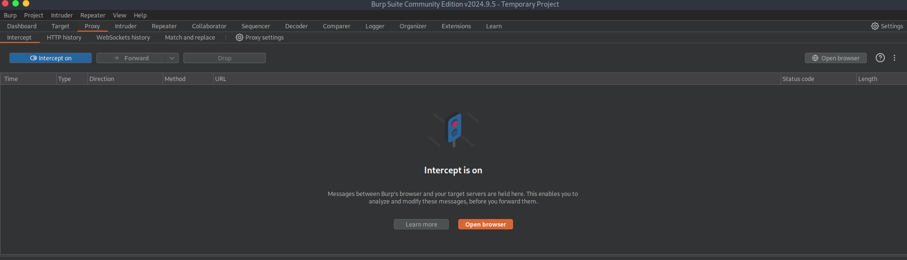

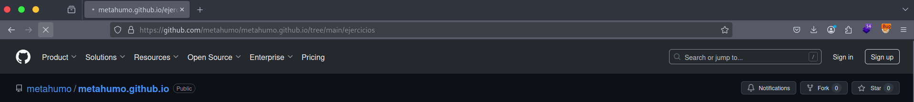

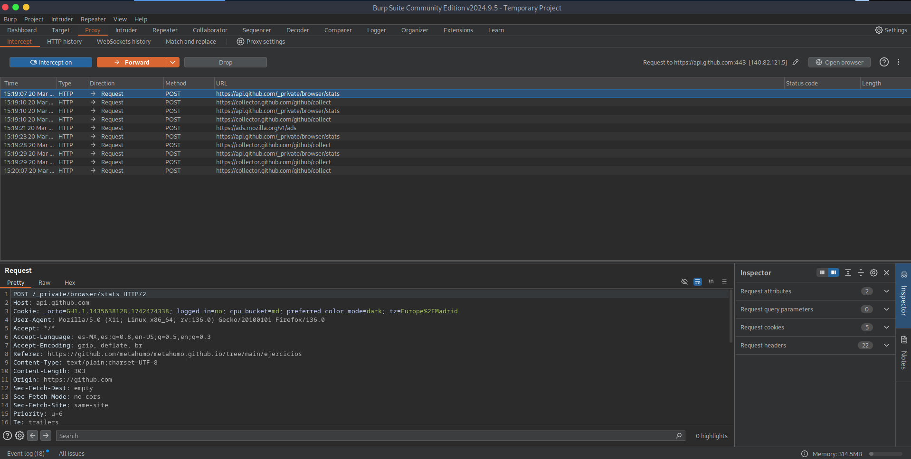

## Apartados de interés en BurpSuite

**HTTP History:** Apartado que recoge el historial de intercepciones. De este modo, podemos hacer seguimiento de cada ruta y analizar sus respuestas.

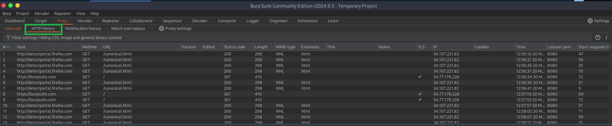

**Target:** Apartado que enumera a modo de directorios las diferentes rutas. Desde aquí obtenemos información detallada tanto de la solicitud como de la respuesta.

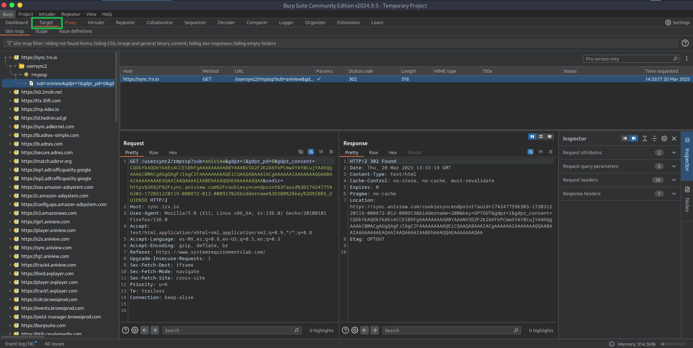
